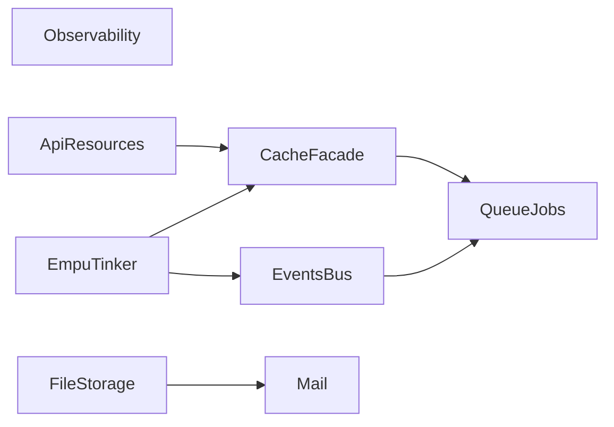

# Purwa — Task Board & Sprint Plan

> **Source of truth for scope:** [PRD.md](./PRD.md)  
> **MVP horizon:** Sprint 1–12 (Phase 1). Post-MVP items live in PRD §7.2 only — not scheduled here unless pulled in.

This document turns PRD §12 and §11 (Definition of Done) into **executable sprints**. Each sprint has a goal, deliverables, **acceptance criteria**, and **dependencies**. Agents should implement in sprint order unless a task explicitly allows parallel work.

---

## How to use this file

| Column / section | Meaning |
|------------------|---------|
| **Sprint** | Time-boxed goal (align with PRD months 1–3 coarse plan; adjust velocity per team). |
| **Done when** | Objective checks; tie to PRD §11 where applicable. |
| **Tasks** | Checkbox items; prefer one PR per logical task group. |
| **Depends on** | Prior sprints that must be merged first. |
| **AI / agents** | [AGENT.md](./AGENT.md), [AGENTS.md](./AGENTS.md), and `.cursor/rules/*.mdc` — read before autonomous work. |

**Quality bar (every sprint):** `cargo fmt`, `cargo clippy -- -D warnings`, tests green, no dead public API without issue link, no duplicate helpers — consolidate in `purwa-core` or the owning crate.

---

## Resolved decisions (Q1–Q4)

| ID | Decision | Rationale (PRD-aligned) |
|----|-----------|-------------------------|
| **Q1 — License** | **MIT** | Cocok untuk OSS; gesekan hukum minimal; selaras dengan ekosistem Rust banyak library; satu LICENSE file di root cukup untuk seluruh workspace kecuali crate pihak ketiga punya syarat lain. |
| **Q2 — crates.io** | **Multi-crate, semver selaras, rilis batch di MVP** | PRD §5.1 memisahkan library (`purwa`, `purwa-core`, …) dan binary **`purwa-cli`** (`cargo install` → `empu`). **Rilis pertama:** saat S12 / MVP siap, semua crate library + CLI naik **versi sama** (mis. `0.1.0`) dalam satu “release train” agar `purwa = "0.1"` dan feature flags tetap cocok. **Pra-rilis opsional:** `0.1.0-alpha.N` bila butuh umpan balik sebelum MVP. **Jangan** menunda publish sampai “1.0” semata — MVP cukup sebagai `0.1.0` publik; breaking changes naik minor/major sesuai semver. |
| **Q3 — `#[resource]`** | **Wajib MVP** | PRD §7.1 sudah memasukkan `#[resource]`; DoD §11 mensyaratkan CRUD cepat — resource routing adalah bagian DX Laravel-like. S2 harus menyampaikan **macro lengkap** (index/store/update/destroy + nama route), bukan stub. |
| **Q4 — Integration tests & DB** | **Dua lapis (bukan pilih salah satu)** | **(A) CI & integration test framework:** Postgres **nyata** lewat **testcontainers** (atau layanan Postgres di CI) untuk modul `purwa-orm`, migrasi, dan alur yang butuh SQL — ini setara “Laravel RefreshDatabase” / koneksi DB sungguhan, cocok dengan SQLx `query!` dan migrasi. **(B) `purwa-testing` / app tests:** dukung **tanpa DB jalan** memakai **mock pool** atau state palsu (PRD §11) untuk tes handler cepat. **Lokal:** dokumentasikan `TEST_DATABASE_URL` opsional bagi kontributor tanpa Docker. |

---

## Brainstorming summary (shared understanding)

- **What:** Open-source Rust web framework + CLI (`empu`), Laravel-like conventions, Tower/Axum-native, **no** separate compile-time DI binary — use `State` / `FromRef` / extensions.
- **Sweet spot:** CRUD + auth + Svelte/Inertia dashboard in &lt; 1 day for a Laravel-experienced dev (north star).
- **Hard choices from PRD:** `inventory` for route registration; first-party `purwa-inertia`; SQLx default ORM; “fast rebuild watch” not hot reload; `empu tinker` out of MVP.
- **Non-goals for TASK.md scope:** GraphQL/gRPC, WASM plugins, opinionated WebSocket layer, Windows-first dev (document Unix assumptions).

---

## Dependency graph (high level)

```text
S1 Workspace ──► S2 Routing ──► S3 Config/State ──► S4 DB ──► S5 Validation
                                                      │
         S6 Inertia ◄─────────────────────────────────┤
              │
              ▼
         S7 Auth ──► S8 CLI generators ──► S9 Frontend pipeline
                                              │
         S10 Errors/Logging ◄──────────────────┼──► S11 Testing
                                              │
                                              ▼
                                         S12 Polish/Docs/Release
```

S10 can start once S6 has minimal render path; finish S10 after S7–S9 for auth and asset errors.

---

## Sprint 1 — Workspace & foundations

**Goal:** Repo builds as a Cargo workspace; CI enforces quality; `purwa-core` boots Axum “hello world”.

**Depends on:** —

### Tasks

- [x] Create workspace `Cargo.toml` with crates: `purwa` (facade), `purwa-core`, `purwa-inertia`, `purwa-orm`, `purwa-auth`, `purwa-cli`, `purwa-testing` (stubs OK).
- [x] Add **MIT** `LICENSE` (see § Resolved decisions Q1), CODEOWNERS if needed, `rust-toolchain.toml` if pinned.
- [x] CI: `cargo test`, `clippy -D warnings`, `fmt --check` on Linux (macOS optional matrix).
- [x] `purwa-core`: minimal Axum 0.8 app + one GET route; export pattern for “escape hatch” `Router`.
- [x] Document in README: supported platforms (Linux/macOS primary).

### Done when

- [x] Fresh clone → `cargo build -p purwa-core` succeeds.
- [x] CI green on default branch.
- [x] PRD architecture §5.1 layout reflected in repo (empty crates acceptable).

---

## Sprint 2 — Routing macros

**Goal:** `#[get]`, `#[post]`, `#[put]`, `#[delete]` (and path/method correctness); `inventory` registration; `empu route:list` **or** internal equivalent that reads registry (full Empu integration can land in S8 if registry API is stable).

**Depends on:** S1

### Tasks

- [x] Proc-macro crate (e.g. `purwa-macros` or under `purwa-core`) using `syn 2`, `quote`, `proc-macro2`.
- [x] Integrate `inventory` for handler registration; document WASM limitation (PRD §10).
- [x] `router!()` / startup collector merges registered routes into Axum `Router`.
- [x] **`#[resource]` — MVP penuh:** macro menghasilkan set route REST (index, create, store, show, edit, update, destroy) + nama handler konsisten; selaras PRD §7.1 dan DoD CRUD &lt; 2 jam.
- [x] `empu route:list`: pretty table (method, path, handler name) **or** CLI placeholder + library API that returns structured list (finish in S8 if split).

### Done when

- [x] At least two handlers in a test app register without manual `Router` wiring.
- [x] PRD §11: `empu route:list` criterion satisfied **or** explicitly split with acceptance in S8 checklist.

---

## Sprint 3 — Config & application state

**Goal:** `purwa.toml` + `.env` via `dotenvy`; typed config; `AppState` pattern documented and usable from handlers.

**Depends on:** S2

### Tasks

- [x] Parse `purwa.toml` + merge with `config` crate / env overrides.
- [x] `AppState` template: `PgPool` placeholder or trait for later S4, `Arc` usage, no globals.
- [x] `FromRef` / `State` examples for sub-state slices if needed.
- [x] `.env.example` in scaffold (scaffold itself refined in S8).

### Done when

- [x] Example app reads a config key in a handler test.
- [x] PRD §5.3 constraints: no `lazy_static` in user-facing examples.

---

## Sprint 4 — Database layer

**Goal:** SQLx `PgPool` in state; migration runner; `empu migrate`, `rollback`, `fresh`; helpers for `query!`.

**Depends on:** S3

### Tasks

- [x] `purwa-orm`: SQLx integration, connection from config.
- [x] Timestamped SQL migrations layout per PRD §6; embed or run from `database/migrations`.
- [x] CLI: `empu migrate`, `empu migrate:rollback`, `empu migrate:fresh` (names per PRD §8.1).
- [x] Optional feature scaffold: `sea-orm` behind `purwa` feature flag (can be minimal in this sprint).

### Done when

- [x] PRD §11: `empu migrate` runs cleanly on sample project.
- [x] **Integration tests (Q4):** minimal satu alur migrasi + query terhadap Postgres **nyata** di CI via **testcontainers** (disarankan) atau job CI dengan service Postgres; dokumentasi env `TEST_DATABASE_URL` untuk lokal.

---

## Sprint 5 — Validation

**Goal:** Request DTOs with `validator`; `ValidatedForm<T>` (or equivalent) extractor; consistent JSON/Inertia error shape.

**Depends on:** S4

### Tasks

- [x] Derive/helper for validated forms (`#[derive(Validate)]` + Purwa wrapper).
- [x] Axum extractor returning typed errors mapping to `PurwaError` (stub enum extended in S10).
- [x] `empu make:request <Name>` template (generator polish in S8).

### Done when

- [x] Invalid payload returns structured errors usable from Svelte forms.
- [x] Clippy clean.

---

## Sprint 6 — Inertia adapter (`purwa-inertia`)

**Goal:** First-party Inertia v1.3 protocol: headers, partial reloads, shared props middleware, asset versioning hook.

**Depends on:** S2, S3 (S5 nice for errors)

### Tasks

- [x] `X-Inertia` detection; `Inertia::render()` with serde props.
- [x] `X-Inertia-Partial-Data` handling (PRD §11).
- [x] Shared props middleware; asset version string from config.
- [x] SSR fallback story: document MVP behavior (full page vs minimal).

### Done when

- [x] Manual or automated test proves partial reload path.
- [x] No dependency on unmaintained third-party Inertia crates for core path.

---

## Sprint 7 — Authentication

**Goal:** Session auth + API token path per PRD; `#[auth]` guard; `empu make:auth` output.

**Depends on:** S4, S6

### Tasks

- [x] `purwa-auth`: `tower-sessions` (0.14, aligned with `axum-login` 0.18), `axum-login` integration.
- [x] Register/login/logout + password hashing — **Argon2id** default (PHC strings); bcrypt not used (see `purwa-auth::password`).
- [x] `CurrentUser` extractor; `#[auth(Backend)]` on **parameterless** handlers (`purwa` feature `auth`); use `AuthSession` / `login_required!` for richer cases.
- [x] Policy stub: struct-based (PRD §13 #2) — [`purwa_auth::Gate`] / [`purwa_auth::Policy`].
- [x] API token path stub: [`purwa_auth::ApiTokenStore`], [`purwa_auth::authorization_bearer`].
- [x] `empu make:auth`: `users` migration + `src/app/http/auth.rs` template (Argon2 via `insert_user`).

### Done when

- [x] PRD §11: session auth path available via `empu make:auth` + `purwa`/`purwa-auth` (full scaffolded app in S8).
- [x] Escape hatch: raw `tower-sessions` / `AuthSession` documented in `purwa-auth` crate docs.

---

## Sprint 8 — Empu CLI core

**Goal:** `empu new` full-stack scaffold; `make:controller`, `make:service`, `make:model`, `make:migration`, etc. per PRD §8.1 MVP table.

**Depends on:** S2, S3, S4, S7 (auth template)

### Tasks

- [x] `clap` + `inquire` for `empu new` wizard (`--yes` non-interactive; `--purwa-path` for local `purwa` facade).
- [x] Codegen with **Askama** (`purwa-cli/templates/`); global `--verbose` / `--dry-run`.
- [x] `empu serve` (`cargo run`, `RUST_LOG=debug` if unset), `empu dev` (`cargo watch -x run`; needs `cargo install cargo-watch`), `empu build` (`cargo build --release` + optional `frontend/` `npm ci && npm run build` on Unix).
- [x] **`empu route:list`:** runs `cargo run --bin purwa-print-routes` (scaffolded app); `--json` supported.
- [x] `make:controller`, `make:service`, `make:model` (`--sea-orm` notes only), `make:migration` (paired `.up.sql` / `.down.sql`); `make:request` / `make:auth` ported to templates.
- [x] **Deferred (explicit):** `make:seeder`, `make:policy`, `db:seed` — stub subcommands printing pointer to roadmap / GitHub. **`inertia:setup`** implemented in Sprint 9.

### Done when

- [x] PRD §11: `empu new` + cold build baseline documented in generated **README** (~30s or document hardware / `CARGO_TARGET_DIR`).
- [x] PRD §8.1: core commands implemented; deferred items above documented in this TASK + stub CLI output.

---

## Sprint 9 — Frontend pipeline

**Goal:** Vite + Svelte template; `empu inertia:setup`; built assets in `public/`; versioning wired to `purwa-inertia`.

**Depends on:** S6, S8

### Tasks

- [x] Default `frontend/` layout per PRD §6; Pages/Components conventions.
- [x] Vite config for Inertia client; env for backend URL.
- [x] `empu build` runs frontend build and places artifacts.
- [x] Document Node version.

### Done when

- [x] New app serves at least one Inertia page end-to-end in dev and prod build.

---

## Sprint 10 — Error handling & logging

**Goal:** `PurwaError`; `IntoResponse`; pretty Inertia error page; tracing subscribers (pretty dev / JSON prod).

**Depends on:** S6 (S9 for asset errors optional)

### Tasks

- [x] Central error enum; `thiserror` in libraries, `anyhow` guidance for apps.
- [x] Map validation/auth/DB errors to HTTP + Inertia responses.
- [x] Tracing setup helper in `purwa-core` or facade.

### Done when

- [x] One integration test asserts error response shape.
- [x] PRD §11: pretty error page for Inertia navigations.

---

## Sprint 11 — Testing crate

**Goal:** `purwa-testing`: app builder, mock state, DB fixtures; examples for integration tests.

**Depends on:** S4, S7

### Tasks

- [ ] Test `Router` builder with overridden state (deferred: inventory router remains `Router<()`>; composition with `State<AppState>` is app-level — see README routing note).
- [x] **Tanpa DB (PRD §11):** mock `PgPool` / stub repository atau helper yang membuat tes handler tidak wajib menjalankan Postgres.
- [x] **Dengan DB:** arahkan contoh integration test aplikasi ke pola yang sama S4 (testcontainers atau `TEST_DATABASE_URL`); jangan duplikasi logic — satu sumber kebenaran di docs.
- [x] Example `tests/` in template repo (satu contoh no-DB + satu opsional with-DB).

### Done when

- [x] PRD §11: mock pool / no-DB test path documented and working.
- [x] Dokumentasi menjelaskan kapan pakai mock vs Postgres sungguhan (selaras § Resolved decisions Q4).

---

## Sprint 12 — MVP polish, documentation, release

**Goal:** Public MVP: docs, contribution guide, README philosophy (ID + EN), API docs, release checklist.

**Depends on:** S1–S11

### Tasks

- [x] Getting Started (~15 min) + Architecture + Escape Hatches guides.
- [x] `CONTRIBUTING.md`, issue templates optional.
- [x] README: Purwa–Empu philosophy bilingual.
- [x] Crates.io **release train documented** (`RELEASING.md` — order, metadata, aligned semver); **actual `cargo publish`** when maintainers run the checklist.
- [x] Final pass: no `#[allow(dead_code)]` in workspace `.rs` (verified); facade re-exports reviewed — intentional for DX / escape hatches ([`purwa/src/lib.rs`](purwa/src/lib.rs)).

### Done when

- [x] PRD §11 criteria mapped to evidence ([`docs/mvp-checklist.md`](docs/mvp-checklist.md)); release-time QA and publish remain maintainer actions.
- [x] Security / session sign-off checklist for maintainers ([`docs/mvp-checklist.md`](docs/mvp-checklist.md) § Maintainer security sign-off).

---

## Phase 2 — Backlog (post-MVP)

**Sumber scope:** [PRD.md §7.2](./PRD.md) (Phase 2, Months 7–12). Item di bawah ini **bukan** sprint bernomor; promosikan ke sprint/issue hanya setelah disepakati dan **TASK + PRD** selaras. Jangan menambah epik besar tanpa mengubah atau merujuk PRD.

**Urutan kasar (bukan roadmap tanggal):** fasilitas horizontal dulu — **cache**, **events**, **observability** — lalu integrasi yang lebih berat (**queue/jobs**, **mail**, **file storage**), lalu **API resources** (transformer, pagination, versioning), terakhir **`empu tinker`** (risiko/effort tertinggi, eksplisit aspirational di PRD §4.2.6).

**Dependensi epik (ringkas):**



Observability bisa dikerjakan paralel dengan cache/events; Tinker mengasumsikan pola app context yang matang.

### Epik: Queue & Jobs (PRD §7.2)

- [x] Crate workspace **`purwa-queue`** (atau modul setara) dengan Redis (`deadpool-redis` / stack yang disepakati).
- [x] Macro **`#[job]`** + registrasi + runner (retry, backoff).
- [x] **`empu make:job`** + dokumentasi konfigurasi Redis.
- [ ] Penjadwal **cron** (syntax yang didokumentasikan) atau integrasi crate scheduler.
- [x] Tes integrasi (testcontainers Redis atau lingkungan sekali pakai).

### Epik: Mail & Notifications (PRD §7.2)

- [ ] Driver SMTP (**`lettre`** atau setara), konfigurasi aman (secrets, TLS).
- [ ] Pola pengiriman notifikasi dari handler / job.
- [ ] **Investigate / spike:** email template Svelte lewat Inertia SSR — pisahkan hasil “feasible untuk v1 Phase 2” vs “defer”.

### Epik: File Storage (PRD §7.2)

- [ ] Abstraksi **`object_store`** (local + S3-compatible).
- [ ] **`empu make:disk`** (atau nama setara) + konfigurasi `purwa.toml`.
- [ ] Dokumentasi escape hatch (upload langsung vs facade).

### Epik: Caching facade (PRD §7.2)

- [ ] API Laravel-like **`get` / `put` / `remember`** (dan error semantics yang jelas).
- [ ] Backend **Moka** (in-memory) + **Redis** (opsional feature).
- [ ] Integrasi contoh dengan **`AppState`** (selaras PRD §5.3).

### Epik: Events & listeners (PRD §7.2)

- [ ] Event bus berbasis **Tokio** (broadcast / channel — pilih satu pola dan dokumentasikan).
- [ ] Macro **`#[listen]`** atau registrasi setara.
- [ ] Dokumentasi thread-safety dan batasan async.

### Epik: API resources (PRD §7.2)

- [ ] Transformer JSON terstruktur (“API resource” Laravel-class).
- [ ] Pagination **cursor** + **offset** (kontrak response stabil).
- [ ] **API versioning** (prefix atau header — keputusan desain + docs).

### Epik: Observability (PRD §7.2)

- [ ] Export **OpenTelemetry** (trace) — opt-in, tidak memecahkan default app ringan.
- [ ] Endpoint metrik **Prometheus** (opsional middleware/layer).
- [ ] Dokumentasi deployment (env, sampler, redaction).

### Epik: REPL / `empu tinker` (PRD §4.2.6, §7.2)

- [ ] Spike: harness **async Tokio** + konteks app (DB, config) tanpa full interpreter Rust.
- [ ] Perintah **`empu tinker`** + batasan eksplisit (bukan “REPL bahasa penuh”).
- [ ] Keputusan: ship sebagai **experimental** atau tetap dokumen-only jika tidak memenuhi bar kualitas.

### Celah MVP vs PRD §8.1 (audit CLI, 0.1.x)

Perintah di [PRD §8.1](./PRD.md) tidak semua setara tingkat implementasi di **`purwa-cli`**:

| Perintah | Status di codebase | Catatan |
|----------|-------------------|---------|
| `empu migrate`, `empu migrate:rollback` | Implemented | [`migrate_cmd`](purwa-cli/src/migrate_cmd.rs) |
| `empu migrate:fresh` | Implemented | [`run_migrate_fresh`](purwa-cli/src/main.rs) |
| `empu make:seeder` | Implemented (0.1.1) | [`generate::make_seeder`](purwa-cli/src/generate/mod.rs) |
| `empu make:policy` | **Stub** | idem |
| `empu db:seed` | Implemented (0.1.1) | [`runners::run_db_seed`](purwa-cli/src/runners.rs) |

Keputusan produk (pilih saat promosi ke sprint):

- **(A)** Tutup celah sebagai patch **0.1.x** (Laravel-parity CLI untuk seed/policy).
- **(B)** Geser implementasi penuh ke **Phase 2** dan perbarui PRD §8.1 agar jujur tentang MVP vs roadmap.

### Di luar Phase 2 sampai PRD berubah

Tetap **non-goal** MVP per PRD §3.2: **GraphQL/gRPC**, **WASM macro routing**, **Windows-first dev environment**. **WebSocket framework opinionated** tetap di luar kecuali PRD diperluas.

---

## crates.io naming

**Verified:** nama `purwa` **tersedia** di crates.io (belum dipakai crate publik). Rilis S12 bisa memakai `purwa` sebagai facade crate; pastikan nama `purwa-cli` / `empu` juga bebas saat mendekati publish.

Q1–Q4: lihat **§ Resolved decisions** di atas.

---

## Changelog of this task file

| Date | Change |
|------|--------|
| 2026-04-26 | Initial TASK.md from PRD v1.0 draft |
| 2026-04-26 | Q1 MIT; Q2 publish strategy; Q3 `#[resource]` MVP; Q4 hybrid testing; open questions trimmed |
| 2026-04-26 | crates.io: `purwa` name availability confirmed |
| 2026-04-26 | AGENT.md, AGENTS.md, `.cursor/rules/` added; TASK links agents |
| 2026-04-26 | Sprint 1: Cargo workspace, stubs, `purwa-core` Axum hello, MIT, README, CI |
| 2026-04-26 | Sprint 2: `purwa-macros`, `inventory` routing, `#[resource]`, `format_route_table`, `empu route:list` stub; full CLI deferred S8 |
| 2026-04-26 | Sprint 3: `AppConfig`/`AppState`, dotenvy+config, `purwa.toml.example`, `.env.example`, config integration test |
| 2026-04-26 | Sprint 4: `sqlx`/`PgPool`/`AppState`, `purwa-orm` migrate helpers, `empu migrate*`, `sea-orm` feature stub, testcontainers IT |
| 2026-04-26 | Sprint 5: `validator`, `ValidatedJson`/`ValidatedForm`, `PurwaError` + 422 JSON, `empu make:request` |
| 2026-04-26 | Sprint 6: `purwa-inertia` v1.3 protocol, `[inertia]` config, `purwa` feature `inertia` |
| 2026-04-26 | Sprint 7: `purwa-auth` (Argon2id, `axum-login`, `CurrentUser`, `#[auth]`, policy/token stubs), `purwa` feature `auth`, `empu make:auth` |
| 2026-04-26 | Sprint 8: `empu new` scaffold, Askama templates, `serve`/`dev`/`build`, `route:list` via `purwa-print-routes`, `make:{controller,service,model,migration}`, deferred seed/policy/db:seed stubs (implemented in 0.1.1 patch) |
| 2026-04-26 | Sprint 9: `frontend/` Vite+Svelte+Inertia template, `empu inertia:setup`, `purwa-inertia` HTML shell injection + `vite_manifest`, scaffold `Welcome` + `ServeDir`, `empu build` manifest → `[inertia].asset_version`, `purwa` flattens `purwa-inertia` exports |
| 2026-04-26 | Sprint 10: extended `PurwaError` (401/403/404/DB/internal), `respond_purwa_error` + `Error.svelte`, `CurrentUser` → `PurwaError`, `init_tracing` / JSON prod, integration tests |
| 2026-04-26 | Sprint 11: `purwa-testing` HTTP helpers + optional `postgres` (testcontainers), `TEST_DATABASE_URL` helper; `empu new` test templates; README/AGENT Q4 |
| 2026-04-26 | Sprint 12: `docs/{getting-started,architecture,escape-hatches,mvp-checklist}.md`, README philosophy ID+EN, `CONTRIBUTING.md`, `RELEASING.md`, GitHub issue templates, PRD §11 evidence table |
| 2026-04-26 | crates.io: workspace `repository`/`readme` inheritance, `version = 0.1.0` on internal deps, per-crate docs.rs + keywords; `RELEASING.md` v0.1.0 publish order |
| 2026-04-26 | `CHANGELOG.md` (Keep a Changelog) + GitHub Release steps in `RELEASING.md` |
| 2026-04-27 | Phase 2 backlog expanded from PRD §7.2 (epics + mermaid); MVP CLI audit (seed/policy) |
| 2026-04-27 | Patch 0.1.1 plan: `make:seeder` + `db:seed` implemented; PRD §8.1 status column |

---

*Aligned with PRD — Purwa · Empu · Sangkan.*
