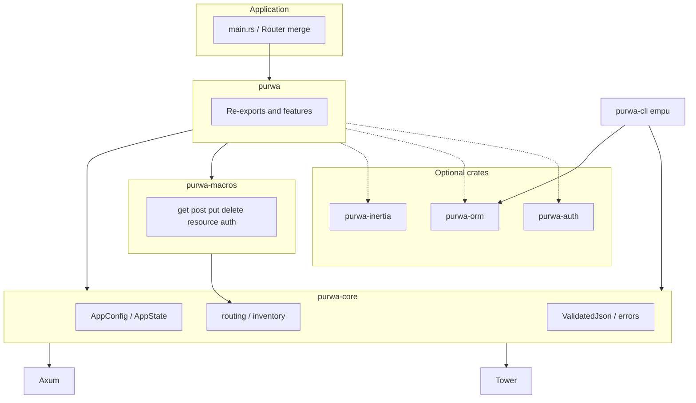

# Architecture overview

Purwa is a **multi-crate workspace**. Applications typically depend on the **`purwa`** facade crate and use **`empu`** for scaffolding and tasks.

## Request path

1. **Axum** receives an HTTP request on a **`Router`** built in your binary (often by merging **`router_from_inventory()`** with layers, state, and static files).
2. **Tower** middleware runs (sessions, tracing, shared props for Inertia, etc.).
3. Handlers use **extractors** (`State`, `Json`, `InertiaRequest`, `ValidatedJson`, …) and return types that implement **`IntoResponse`** (including **`PurwaError`**).

## Routing and `inventory`

HTTP verbs and **`#[resource]`** are defined in **`purwa-macros`**. They register **`RegisteredRoute`** entries via the **`inventory`** crate (linker-backed). At startup, **`router_from_inventory()`** in **`purwa-core`** merges installers into a single Axum **`Router<()>`**.

**Limitation:** `inventory` does not support **`wasm32`**. Use native targets for macro-based routing.

## Configuration

- **`purwa.toml`** in the working directory (optional keys merged with defaults).
- **Environment** with prefix **`PURWA__`** (nested: **`PURWA_SERVER__PORT`**).
- **`.env`** loaded with **`dotenvy`** in typical app `main`.

See [purwa.toml.example](../purwa.toml.example) in the repo.

## Data layer

- **Default:** **SQLx** (`PgPool`, migrations) via **`purwa-orm`** helpers and **`empu migrate`**.
- **Optional:** **SeaORM** behind the **`sea-orm`** feature on **`purwa`** / **`purwa-orm`** (see crate manifests).

## Full-stack (Inertia)

**`purwa-inertia`** implements the Inertia protocol (v1.3-oriented): first visit vs X-Inertia JSON responses, shared props, partial reload headers, asset version checks. The scaffold uses **Svelte** on the **Vite** side.

## CLI

**`purwa-cli`** publishes the **`empu`** binary: `new`, `serve`, `dev`, `build`, generators (`make:request`, `make:auth`, …), migrations, `route:list`, etc.

## Testing

Fast tests avoid a real **`PgPool`** where possible; integration tests may use **testcontainers** or **`TEST_DATABASE_URL`**. See [README](../README.md) and **`purwa-testing`**.
